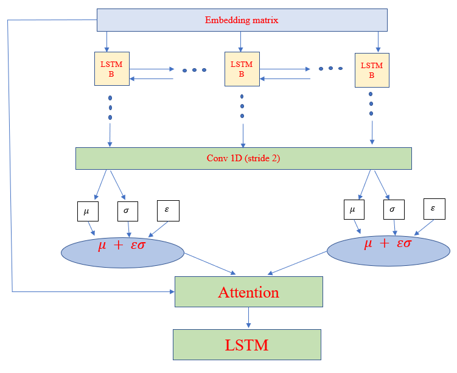

## VAE_text -Pytorch
Short overview:

Implementation of Varational Auto Encoder for text generation.
In this project I trained it over 10 seasons of freinds.
Created one model which encodes every character specific distribution. 
This was done by adding to the vocabulary a charecter token. (The same as <SOS> but there are severals <SOS>
each for every charecter)
for example in freinds the tokens are : [“Phoebe_speak”,”Joey_spaek”,” Ross_spaek” ,” Rachel_speak”,” Monica_spaek”,” Chandler _speak”]
 
Model architecture:
## simple Model architecture visualization

 
